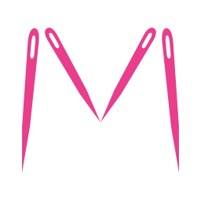
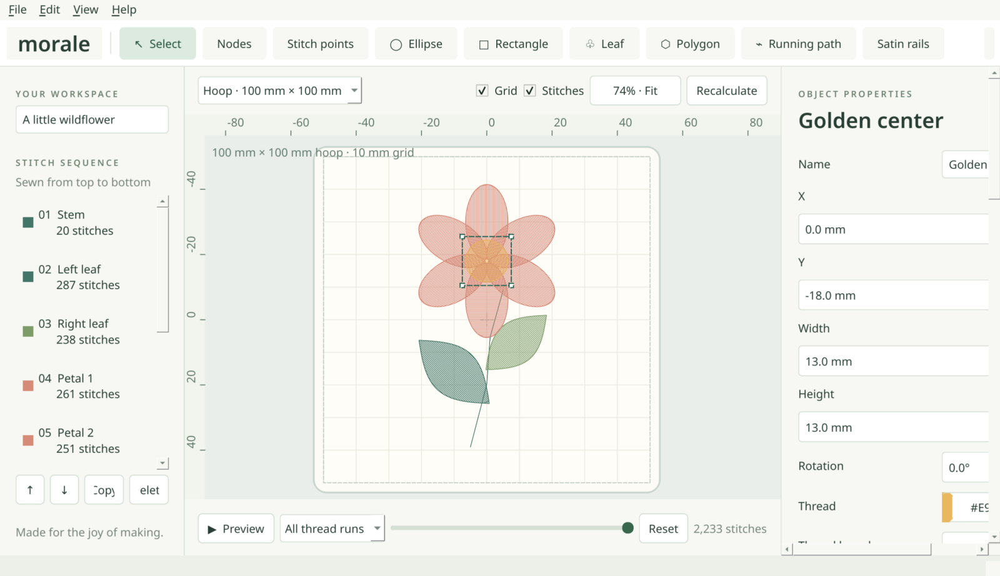

# Morale user guide

This guide walks through the everyday things you can do in Morale, one step at a
time. You do not need any embroidery software experience. If a word is new to you,
look it up in [Embroidery words explained](#embroidery-words-explained) at the end.

**Contents**

1. [The Morale window](#the-morale-window)
2. [Opening a design](#opening-a-design)
3. [Starting a new design](#starting-a-new-design)
4. [Drawing shapes](#drawing-shapes)
5. [Adding lettering](#adding-lettering)
6. [Turning a picture into embroidery](#turning-a-picture-into-embroidery)
7. [Choosing thread colours](#choosing-thread-colours)
8. [Checking your design before you sew](#checking-your-design-before-you-sew)
9. [Sending a design to your machine](#sending-a-design-to-your-machine)
10. [Saving your work](#saving-your-work)
11. [Designs bigger than your hoop](#designs-bigger-than-your-hoop)
12. [Your first test stitch-out](#your-first-test-stitch-out)
13. [Keyboard and larger text](#keyboard-and-larger-text)
14. [Something went wrong?](#something-went-wrong)
15. [Embroidery words explained](#embroidery-words-explained)

---

## The Morale window

The window has four main areas:

- **Along the top: the tools.** **Select** picks things in your design. The shape
  buttons (**Ellipse**, **Rectangle**, **Leaf**, **Polygon**, **Running path**,
  **Satin rails**) draw new parts. **Save project** and **Export stitches ↗** are
  at the far right.
- **On the left: the stitch sequence.** Every part of the design is listed in the
  order the machine will sew it, from top to bottom, with its thread colour and
  number of stitches. Click a part to select it. The **↑** and **↓** buttons
  change the sewing order, **Copy** makes a duplicate and **Delete** removes it.
- **In the middle: your design** inside the hoop. The hoop size menu sits just
  above it. Use your mouse wheel to zoom and **Fit** to see the whole hoop again.
- **On the right: object properties.** When a part is selected, its size,
  position, thread colour and stitch type appear here and can be changed.

Along the bottom are **▶ Preview**, which shows the design being stitched, and
the total stitch count.

## Opening a design

**To open a design you already have** (from Morale or from your machine):

1. Choose **File → Open design…**.
2. Find the file and click **Open**.

Morale opens its own `.morale` projects and machine files such as PES, DST, EXP,
JEF, VP3 and many more. A small window shows progress for large files; you can
press **Cancel** at any time.

**To look through a folder of designs** with pictures of each one, choose
**File → Browse design folder…**. Click a design to see it, then **Open** it.

**To add a design to the one you are working on**, choose
**File → Import machine design into project…**.

## Starting a new design

1. Choose **File → New design**.
2. Pick your hoop from the hoop menu above the design, for example
   *Hoop · 100 × 100 mm* (a 4 × 4 inch hoop). If your hoop is not listed, choose
   **View → Custom sewing field…** and type its size.
3. Give your design a name in the box under **YOUR WORKSPACE** on the left.

Morale checks that the design fits the hoop before you export it. Use the size
your machine's manual gives for the *sewing area*, which is a little smaller than
the hoop itself.

## Drawing shapes

1. Click a shape button along the top, such as **Ellipse** or **Rectangle**.
2. Press and drag inside the hoop to draw it.
3. Click **Select** to go back to moving things.

**Polygons and paths** are drawn point by point: click where each corner should be,
then press **Enter** (or double-click) to finish. Press **Esc** to cancel.

**Satin rails** draw a smooth, shiny column: click alternately on the left edge
and the right edge of the column, then press **Enter**.

**To move a part**, drag it, or select it and use the arrow keys. **To resize or
rotate it**, type new numbers in the **Object properties** panel on the right.

**To change how it is stitched**, pick a different **Stitch** in the properties
panel. Common choices are *Tatami fill* (a solid filled area), *Running stitch*
(a single line) and *Satin* (smooth columns, good for borders and lettering).

Made a mistake? Choose **Edit → Undo** or press **Ctrl+Z** (**⌘Z** on a Mac).

## Adding lettering

1. Choose **Edit → Add lettering…**.
2. Type your text.
3. Choose a **Font**. Any font installed on your computer works.
4. Set the **Letter height**. Around 10 mm or more sews most reliably; very small
   text is hard for any machine.
5. Leave **Stitches** on **Satin columns** for smooth, shiny letters.
6. Click **OK**.

Morale works out the satin columns for each letter for you. To change the text
later, select it and choose **Edit → Edit lettering…**.

In the same window, set **Layout** to *Curved* to bend text in an arc or to
*Three-letter monogram* for a monogram. To place letters along a line you have
drawn, choose **Edit → Add lettering along path…**.

## Turning a picture into embroidery

Morale can turn a picture into stitches for you. This works best with **simple
artwork**: logos, clip-art, cartoons and drawings with a few solid colours and
clear edges. Photographs do not convert well yet.

1. Choose **File → Digitize artwork…** and pick your picture (PNG, JPEG, BMP,
   WebP or SVG).
2. Set **Artwork width** to the size you want it stitched, in millimetres.
3. Set **Maximum colors** to the number of thread colours you want to use.
4. Optional: under **Thread chart**, pick your thread brand's colour chart so
   Morale chooses real thread colours for you.
5. Click **Generate preview**. After a moment you see your picture, the shapes
   Morale found, and the stitches side by side.
6. Look closely. The table lists each part and the stitch chosen for it; you can
   change any of them. Change settings and press **Generate preview** again as
   often as you like.
7. When you are happy, click **Add traced objects**. The result is added to your
   design, and **Edit → Undo** removes it again.

**Helpful options**

- **Split suitable branching shapes into editable pieces** turns shapes such as
  letters, stars and stems into smooth satin columns.
- **Exclude near-white background** leaves out a white background so it is not
  stitched.
- **Group regions by thread to reduce color changes** reorders the parts so you
  change thread less often.
- **Conversion checks…** lists anything worth a second look, and
  **Density and coverage review…** shows where stitches are very dense or stacked.

## Choosing thread colours

- **For one part:** select it and click the colour button next to **Thread** in
  the properties panel.
- **To match real threads:** select the parts, then choose
  **Edit → Thread catalog / match colors…**. Pick a thread chart and click the
  matching thread, or let Morale match every colour at once.

Screen colours are only a guide. Hold your real thread spools up to the design
before sewing.

To keep a list of the colours in sewing order (handy with DST files, which do not
store colours), choose **File → Export thread chart…**.

## Checking your design before you sew

- **Press ▶ Preview** to watch the design stitch on screen, part by part. Drag
  the slider to jump forward or back, and press **Reset** to see the whole design.
- **Look at the stitch sequence** on the left. Parts sewn on top of others should
  come later in the list.
- **Watch the stitch count.** More stitches means a longer sew and a stiffer result.

## Sending a design to your machine

1. Click **Export stitches ↗** at the top right (or **File → Export machine file…**).
2. Choose the file type your machine uses. The
   [table in the README](../README.md#which-file-type-does-my-machine-use) lists
   the usual type for each brand, for example **PES** for Brother and **EXP** for
   Bernina.
3. Choose where to save it, for example your USB stick, and click **Save**.
4. Put the USB stick in your machine (or use your machine's usual transfer
   method) and open the design there.

To line the design up on your fabric, **File → Export placement template (PDF)…**
makes a full-size printout. Print it at **100 %** ("actual size") and check the
ruler on it measures correctly.

## Saving your work

- **File → Save project** keeps a `.morale` file with everything you can edit:
  shapes, lettering and settings. Save one alongside every machine file you make,
  because machine files only store stitches.
- **File → Save project as…** saves a copy under a new name.
- If Morale or your computer closes unexpectedly, Morale offers to **bring your
  design back** the next time it starts. You can also choose
  **File → Recover interrupted session…**.

## Designs bigger than your hoop

**File → Split for multiple hoopings…** divides a large design into pieces that
each fit your hoop, with alignment marks so the pieces line up. It saves the
pieces, a printed map and instructions together in one folder. Sew a test on
scrap fabric first, because lining up the pieces takes practice.

## Your first test stitch-out

Morale is new, and its stitches have not yet been tried on many machines.
Please always test first:

1. Use scrap fabric like the fabric you will really use, with stabilizer
   underneath.
2. Sew the design once and look for gaps, puckering or loose threads.
3. Adjust (for example make lettering larger or pick a different stitch type)
   and try again.

A ready-made test design is included in the `examples/branch-sewout` folder.
Photos of your results, with the name of your machine, are very welcome on the
[issues page](https://github.com/vomitselfie/Morale/issues).

## Keyboard and larger text

- **Larger text:** Morale uses your computer's text size. Change it in your
  computer's display or accessibility settings and restart Morale.
- **Menus:** press **Alt** (on Windows and Linux) to reach the menus with the
  keyboard; every entry has an underlined letter.
- **Useful keys:**

| Key | What it does |
| --- | --- |
| Ctrl+Z (⌘Z) | Undo |
| Ctrl+Y or Ctrl+Shift+Z (⌘⇧Z) | Redo |
| Ctrl+S (⌘S) | Save the project |
| Ctrl+L (⌘L) | Add lettering |
| Arrow keys | Move the selected part by 0.1 mm |
| Shift + arrow keys | Move the selected part by 1 mm |
| Enter | Finish a polygon, path or satin column |
| Esc | Cancel what you are drawing |

## Something went wrong?

**My machine does not show the design.**
Check that you chose the right file type for your machine, that the file is in
the folder your machine expects on the USB stick, and that the design is not
larger than your machine's hoop.

**The design is too big for my hoop.**
Select everything (**Edit → Select all objects**) and choose
**Edit → Arrange object → Scale / rotate selection…** to make it smaller, or split
it with **File → Split for multiple hoopings…**.

**The fabric puckered or the stitches are too thick.**
Use a firmer stabilizer. In **Digitize artwork**, the
**Density and coverage review…** shows the busiest areas. Larger lettering and
fewer overlapping parts also help.

**I changed something by mistake.**
Choose **Edit → Undo** (Ctrl+Z / ⌘Z), as many times as you need.

**Morale closed unexpectedly.**
Open it again and accept the offer to recover your design, or use
**File → Recover interrupted session…**. Please tell us what happened on the
[issues page](https://github.com/vomitselfie/Morale/issues).

---

## Embroidery words explained

| Word | Meaning |
| --- | --- |
| **Digitizing** | Turning a picture or idea into stitches a machine can sew. |
| **Hoop** | The frame that holds the fabric tight while the machine sews. Its *sewing area* is the space the needle can reach. |
| **Stabilizer** | A backing (tear-away, cut-away or water-soluble) that stops the fabric stretching or puckering. |
| **Topping** | A thin water-soluble film placed on top of towels or fleece so stitches do not sink in. |
| **Running stitch** | A single line of stitches, used for outlines and fine details. |
| **Satin stitch** | Close zigzag stitches that make a smooth, shiny column. Used for borders and lettering. |
| **Fill (tatami)** | Rows of stitches that cover a larger area, like woven cloth. |
| **Underlay** | Hidden stitches sewn first to hold the fabric and support the stitches on top. |
| **Density** | How close together the stitches are. Too dense can make fabric stiff or pucker. |
| **Jump** | The needle moving to a new place without sewing. |
| **Trim** | The machine cutting the thread, usually before a long jump. |
| **Stitch sequence** | The order in which the parts of a design are sewn. |
| **Thread chart** | A list of a thread brand's colours, used to match the design to real spools. |
| **Machine file** | The file your embroidery machine reads, such as PES, EXP, JEF or DST. It holds stitches, not editable shapes. |
| **Project file** | Morale's own `.morale` file, which keeps everything editable. |
